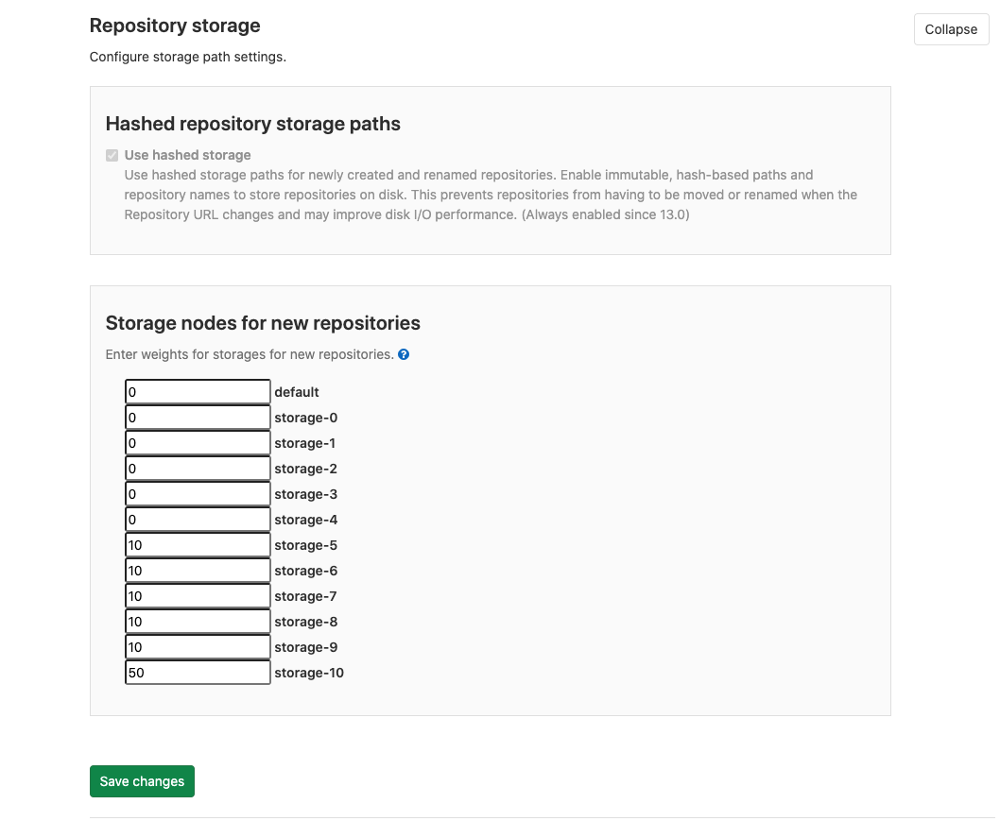

# Repository storage paths

> [Introduced](https://gitlab.com/gitlab-org/gitlab-foss/-/merge_requests/4578) in GitLab 8.10.

GitLab allows you to define multiple repository storage paths (sometimes called
storage shards) to distribute the storage load between several mount points.

> **Notes:**
>
> - You must have at least one storage path called `default`.
> - The paths are defined in key-value pairs. The key is an arbitrary name you
>   can pick to name the file path.
> - The target directories and any of its sub-paths must not be a symlink.
> - No target directory may be a sub-directory of another; no nesting.

Example: this is OK:

```plaintext
default:
  path: /mnt/git-storage-1
storage2:
  path: /mnt/git-storage-2
```

This is not OK because it nests storage paths:

```plaintext
default:
  path: /mnt/git-storage-1
storage2:
  path: /mnt/git-storage-1/git-storage-2 # <- NOT OK because of nesting
```

## Configure GitLab

> **Warning:**
> In order for [backups](../raketasks/backup_restore.md) to work correctly, the storage path must **not** be a
> mount point and the GitLab user should have correct permissions for the parent
> directory of the path. In Omnibus GitLab this is taken care of automatically,
> but for source installations you should be extra careful.
>
> The thing is that for compatibility reasons `gitlab.yml` has a different
> structure than Omnibus. In `gitlab.yml` you indicate the path for the
> repositories, for example `/home/git/repositories`, while in Omnibus you
> indicate `git_data_dirs`, which for the example above would be `/home/git`.
> Then, Omnibus will create a `repositories` directory under that path to use with
> `gitlab.yml`.
>
> This little detail matters because while restoring a backup, the current
> contents of  `/home/git/repositories` [are moved to](https://gitlab.com/gitlab-org/gitlab/blob/033e5423a2594e08a7ebcd2379bd2331f4c39032/lib/backup/repository.rb#L54-56) `/home/git/repositories.old`,
> so if `/home/git/repositories` is the mount point, then `mv` would be moving
> things between mount points, and bad things could happen. Ideally,
> `/home/git` would be the mount point, so then things would be moving within the
> same mount point. This is guaranteed with Omnibus installations (because they
> don't specify the full repository path but the parent path), but not for source
> installations.

Now that you've read that big fat warning above, let's edit the configuration
files and add the full paths of the alternative repository storage paths. In
the example below, we add two more mount points that are named `nfs_1` and `nfs_2`
respectively.

NOTE: **Note:**
This example uses NFS. We do not recommend using EFS for storage as it may impact GitLab's performance. See the [relevant documentation](high_availability/nfs.md#avoid-using-awss-elastic-file-system-efs) for more details.

**For installations from source**

1. Edit `gitlab.yml` and add the storage paths:

   ```yaml
   repositories:
     # Paths where repositories can be stored. Give the canonicalized absolute pathname.
     # NOTE: REPOS PATHS MUST NOT CONTAIN ANY SYMLINK!!!
     storages: # You must have at least a 'default' storage path.
       default:
         path: /home/git/repositories
       nfs_1:
         path: /mnt/nfs1/repositories
       nfs_2:
         path: /mnt/nfs2/repositories
   ```

1. [Restart GitLab](restart_gitlab.md#installations-from-source) for the changes to take effect.

>**Note:**
The [`gitlab_shell: repos_path` entry](https://gitlab.com/gitlab-org/gitlab-foss/-/blob/8-9-stable/config/gitlab.yml.example#L457) in `gitlab.yml` will be
deprecated and replaced by `repositories: storages` in the future, so if you
are upgrading from a version prior to 8.10, make sure to add the configuration
as described in the step above. After you make the changes and confirm they are
working, you can remove the `repos_path` line.

**For Omnibus installations**

1. Edit `/etc/gitlab/gitlab.rb` by appending the rest of the paths to the
   default one:

   ```ruby
   git_data_dirs({
     "default" => { "path" => "/var/opt/gitlab/git-data" },
     "nfs_1" => { "path" => "/mnt/nfs1/git-data" },
     "nfs_2" => { "path" => "/mnt/nfs2/git-data" }
   })
   ```

   Note that Omnibus stores the repositories in a `repositories` subdirectory
   of the `git-data` directory.

## Choose where new repositories will be stored

Once you set the multiple storage paths, you can choose where new repositories
will be stored under **Admin Area > Settings > Repository >
Repository storage > Storage nodes for new repositories**.

Each storage can be assigned a weight from 0-100. When a new project is created, these
weights are used to determine the storage location the repository will be created on.



Beginning with GitLab 8.13.4, multiple paths can be chosen. New repositories
will be randomly placed on one of the selected paths.
