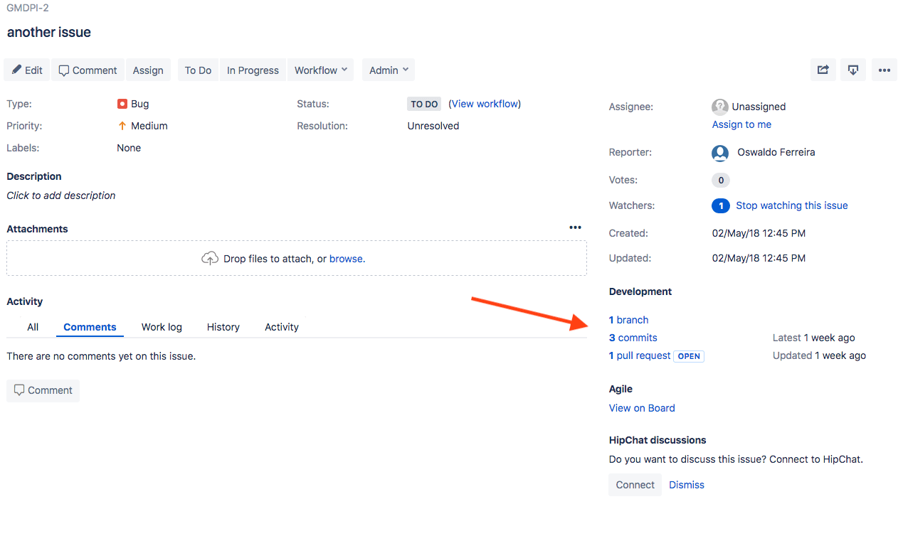
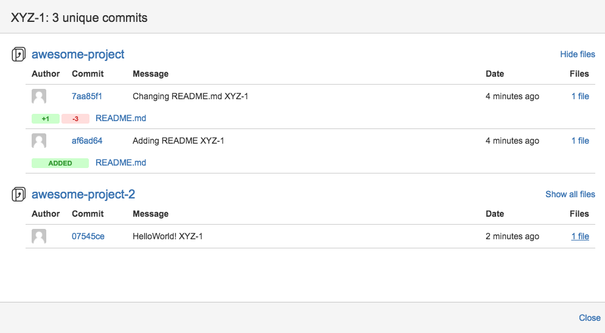
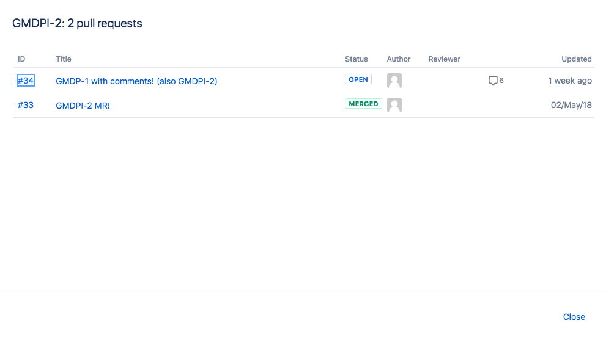

# GitLab Jira development panel integration **[PREMIUM]**

> [Introduced][ee-2381] in [GitLab Premium][eep] 10.0.

Complementary to our [existing Jira][existing-jira] project integration, you're now able to integrate
GitLab projects with [Jira Development Panel][jira-development-panel]. Both can be used
simultaneously. This works with self-hosted GitLab or GitLab.com integrated with self-hosted Jira
or cloud Jira.

By doing this you can easily access related GitLab merge requests, branches, and commits directly from a Jira issue.

This integration connects all GitLab projects within a top-level group or a personal namespace to projects in the Jira instance.
A top-level GitLab group is one that does not have any parent group itself. All the projects of that top-level group,
as well as projects of the top-level group's subgroups nesting down, are connected. Alternatively, you can specify
a GitLab personal namespace in the Jira configuration, which will then connect the projects in that personal namespace to Jira.

NOTE: **Note**:
Note this is different from the [existing Jira][existing-jira] project integration, where the mapping
is one GitLab project to the entire Jira instance.

We recommend that a GitLab group admin
or instance admin (in the case of self-hosted GitLab) set up the integration,
in order to simplify administration.

TIP: **Tip:**
Create and use a single-purpose "jira" user in GitLab, so that removing
regular users won't impact your integration.

## Requirements

### Self-hosted GitLab

If you are using self-hosted GitLab, make sure your GitLab instance is accessible by Jira.

- If you are connecting to Jira Cloud, make sure your instance is accessible via the internet.
- If you are using Jira Server, make sure your instance is accessible however your network is set up.

### GitLab.com

There are no special requirements if you are using GitLab.com.

## GitLab Configuration

1. In GitLab, create a new application in order to allow Jira to connect with your GitLab account

    While logged-in, go to `Settings -> Applications`. (Click your profile avatar at
    the top right, choose `Settings`, and then navigate to `Applications` from the left
    navigation menu.) Use the form to create a new application.

    Enter a useful name for the `Name` field.

    For the `Redirect URI` field, enter `https://<your-gitlab-instance-domain>/login/oauth/callback`,
    replacing `<your-gitlab-instance-domain>` appropriately. So for example, if you are using GitLab.com,
    this would be `https://gitlab.com/login/oauth/callback`.

    NOTE: **Note**:
    If using a GitLab version earlier than 11.3 the `Redirect URI` value should be `https://<your-gitlab-instance-domain>/-/jira/login/oauth/callback`.

    
    - Check `api` in the Scopes section.

2. Click `Save application`. You will see the generated 'Application Id' and 'Secret' values.
    Copy these values that you will use on the Jira configuration side.

## Jira Configuration

1. In Jira, from the gear menu at the top right, go to `Applications`. Navigate to `DVCS accounts`
    from the left navigation menu. Click `Link GitHub account` to start creating a new integration.
    (We are pretending to be GitHub in this integration until there is further platform support from Jira.)

    

2. Complete the form

    Select GitHub Enterprise for the `Host` field.

    For the `Team or User Account` field, enter the relative path of a top-level GitLab group that you have access to,
    or the relative path of your personal namespace.

    

    For the `Host URL` field, enter `https://<your-gitlab-instance-domain>/`,
    replacing `<your-gitlab-instance-domain>` appropriately. So for example, if you are using GitLab.com,
    this would be `https://gitlab.com/`.

    NOTE: **Note**:
    If using a GitLab version earlier than 11.3 the `Host URL` value should be `https://<your-gitlab-instance-domain>/-/jira`

    For the `Client ID` field, use the `Application ID` value from the previous section.

    For the `Client Secret` field, use the `Secret` value from the previous section.

    Ensure that the rest of the checkboxes are checked.

3. Click `Add` to complete and create the integration.

    Jira takes up to a few minutes to know about (import behind the scenes) all the commits and branches
    for all the projects in the GitLab group you specified in the previous step. These are refreshed
    every 60 minutes.

    > **Note:**
    > In the future, we plan on implementating real-time integration. If you need
    > to refresh the data manually, you can do this from the `Applications -> DVCS
    > accounts` screen where you initially set up the integration:
    >
    > 

To connect additional GitLab projects from other GitLab top-level groups (or personal namespaces), repeat the above
steps with additional Jira DVCS accounts.

You may now refer any Jira issue by its ID in branch names, commit messages and  merge request names on GitLab's side,
and you will be able to see the linked `branches`, `commits`, and `merge requests` when entering a Jira issue
(inside the Jira issue, merge requests will be called "pull requests").

Click the links to see your GitLab repository data.

## Limitations

- This integration is currently not supported on GitLab instances under a [relative url][relative-url] (e.g. `http://example.com/gitlab`).

## Changelog

### 11.1

- [Support GitLab subgroups in Jira development panel](https://gitlab.com/gitlab-org/gitlab-ee/issues/3561)

[existing-jira]: ../user/project/integrations/jira.md
[jira-development-panel]: https://confluence.atlassian.com/adminjiraserver070/integrating-with-development-tools-776637096.html#Integratingwithdevelopmenttools-Developmentpanelonissues
[eep]: https://about.gitlab.com/pricing/
[ee-2381]: https://gitlab.com/gitlab-org/gitlab-ee/issues/2381
[relative-url]: https://docs.gitlab.com/omnibus/settings/configuration.html#configuring-a-relative-url-for-gitlab
