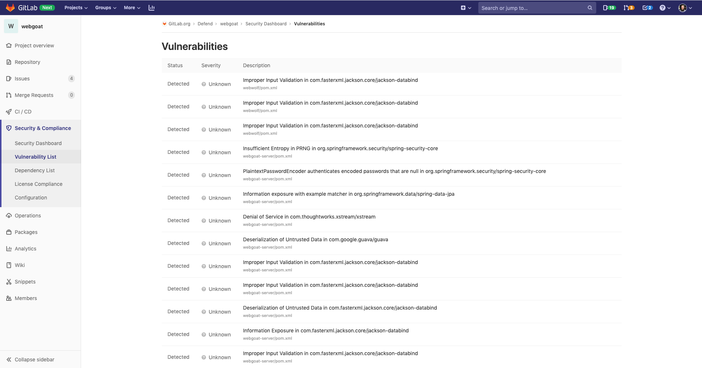

# First Class Vulnerabilities **(ULTIMATE)**

First class vulnerabilites are the next evolution of vulnerabilities at GitLab.
They are an experimental feature and are behind a [feature flag](#enabling-the-feature).
See the relevant section below on how to enable them.

To use first class vulnerabilities, you must first configure one of the [security reports](../index.md).

## Supported reports

First class vulnerabilities are generated from the following reports:

* [Container Scanning](../container_scanning/index.md)
* [Dynamic Application Security Testing](../dast/index.md)
* [Dependency Scanning](../dependency_scanning/index.md)
* [Static Application Security Testing](../sast/index.md)

## Requirements

To use the project vulnerability list:

1. Your project must be configured with at least one of the [supported reports](#supported-reports).
1. The configured jobs must use the [new `reports` syntax](../../../ci/yaml/README.md#artifactsreports).
1. [GitLab Runner](https://docs.gitlab.com/runner/) 11.5 or newer must be used.
   If you're using the shared Runners on GitLab.com, this is already the case.

## Project Vulnerability List

<!-- TODO: When was this introduced? -->
> [Introduced](https://gitlab.com/gitlab-org/gitlab/issues/13561) in [GitLab Ultimate](https://about.gitlab.com/pricing/) 12.9.

At the project level, the Vulnerability List displays the first class vulnerabilities for your project. Use it to find and fix vulnerabilities affecting the [default branch](../../project/repository/branches/index.md#default-branch).

Each vulnerability in this list now has its own, [standalone page](./standalone-page.md).



First, navigate to the **Vulnerability List** found under your project's **Security** tab.

This list is very similar to the current [Security Dashboard](../security_dashboard/index.md) and will eventually replace it.
There are a few key differences however.

1. You can not interract with vulnerabilities on the list view.
Clicking on a vulnerability will take you to a [standalone page](./standalone-page.md).
1. Vulnerabilities on this list are not currently filterable.

### Vulnerability Status

First class vulnerabilities will show a new data-point, *[Status](./standalone-page.md#changing-vulnerability-status)*.
This will be either _Detected_, _Confirmed_, _Dismissed_, or _Resolved_.

## Keeping the vulnerabilities up to date

When the scanners are run on the [default branch](../../project/repository/branches/index.md#default-branch) of a project, any vulnerability findings are auto-promoted to first class vulnerabilities.

If the default branch is updated infrequently, scans are run infrequently and the information on the Vulnerability List can become outdated as new vulnerabilities are discovered.

Unlike Vulnerability findings, first class vulnerabilites will not be removed when the scanners are run again.

To ensure the vulnerabilities are regularly updated, [configure a scheduled pipeline](../../project/pipelines/schedules.md) to run a daily security scan. This will update the information displayed on the Vulnerability List, regardless of how often the default branch is updated.

That way, reports are created even if no code change happens.

## Security scans using Auto DevOps

When using [Auto DevOps](../../../topics/autodevops/index.md), use [special environment variables](../../../topics/autodevops/index.md#environment-variables) to configure daily security scans.

## Enabling the feature

This feature comes with the `:first_class_vulnerabilities` feature flag disabled by default.
To turn on the feature, ask a GitLab administrator with Rails console access to run the following command:

```ruby
Feature.enable(:first_class_vulnerabilities)
```
