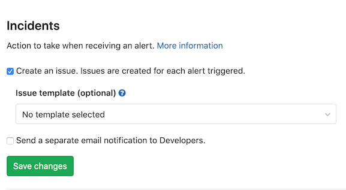

# Incident Management **(ULTIMATE)**

<!--For pages on newly introduced features, add the following line. If only some aspects of the feature have been introduced, specify what parts of the feature.-->
> [Introduced](https://gitlab.com/gitlab-org/gitlab/issues/4925) in GitLab (Ultimate) 11.11.

## Overview

GitLab offers solutions for handling incidents in your applications and services from setting up an alert with Prometheus, to receiving a notification via a monitoring tool like Slack, and automatically setting up Zoom calls with your support team.

## Alerting

GitLab can react to the alerts that your applications and services may be
triggering by automatically creating issues, and alerting developers via email.

### Prometheus Alerts

Prometheus alerts can be set up in both:

- [GitLab-managed Prometheus](../project/integrations/prometheus.md#setting-up-alerts-for-prometheus-metrics-ultimate) and
- [Self-managed Prometheus](../project/integrations/prometheus.md#external-prometheus-instances) installations.

### Alert Endpoint

This generic alert endpoint allows you to send GitLab alert notifications via a Webhook.

Documentation [coming soon](https://gitlab.com/gitlab-org/gitlab/issues/30832).

### Recovery Alerts

GitLab can automatically close issues that have been automatically created when you receive notification that the alert is resolved.

Documentation [coming soon](https://gitlab.com/gitlab-org/gitlab/issues/30832).

## Configuring Incidents

Incident Management features can be enabled and disabled via your project's **Settings > Operations > Incidents**.

### Auto-creation

GitLab issues can automatically be created as a result of an alert notification. An issue created this way will contain error information to help you further debug the error.

### Issue templates

You can create your own [issue templates](../project/description_templates.md#creating-issue-templates)
that can be [used within Incident Management](../project/integrations/prometheus.md#taking-action-on-incidents-ultimate).

To select your issue template for use within Incident Management:

1. Visit your project's **Settings > Operations > Incidents**.
1. Select the template from the **Issue Template** dropdown.

More information on these settings, and how to configure them can be found [here](../project/integrations/prometheus.md#taking-action-on-incidents-ultimate).

## Embedded metrics

Metrics can be embedded anywhere where GitLab Markdown is used, for example, descriptions and comments on issues and merge requests.

### GitLab hosted metrics

GitLab hosted metrics can be embedded by following [these instructions](../project/integrations/prometheus.md#embedding-metric-charts-within-gitlab-flavored-markdown).
Note: This means that GitLab metrics can be [embedded in issue templates](#metrics-in-issue-templates).

### Metrics in issue templates

Documentation [coming soon](https://gitlab.com/gitlab-org/gitlab/issues/30832).

### Grafana metrics

Grafana hosted metrics metrics can be embedded in issues by following [these instructions](../project/integrations/prometheus.md#embedding-live-grafana-charts).

## Slack integration

Slack slash commands allow you to control GitLab and view content right inside Slack, without having to leave it.

### Setting it up

To setup Slack slash commands with GitLab, see [this guide](../project/integrations/slack_slash_commands.md).

### Slash commands

Examples of Slash commands and how to use them can be [found here](../../integration/slash_commands.md).

## Zoom in Issues

Documentation [coming soon](https://gitlab.com/gitlab-org/gitlab/issues/30832).
