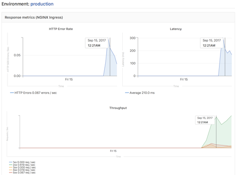
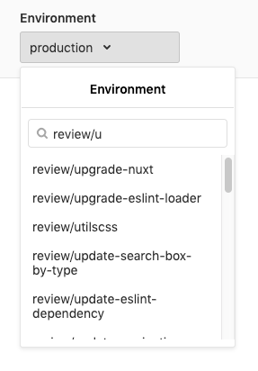
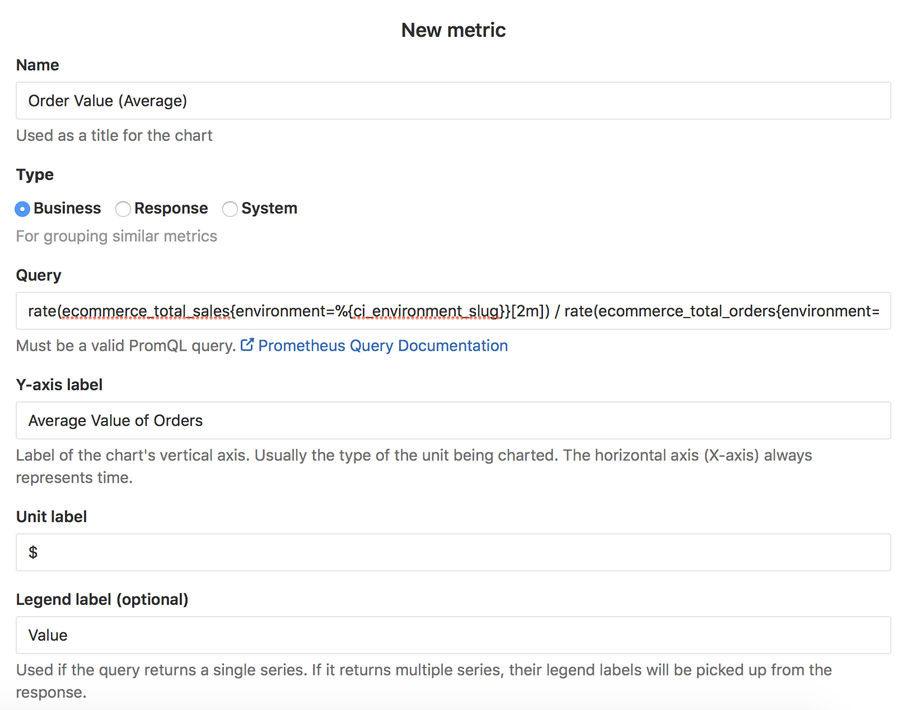
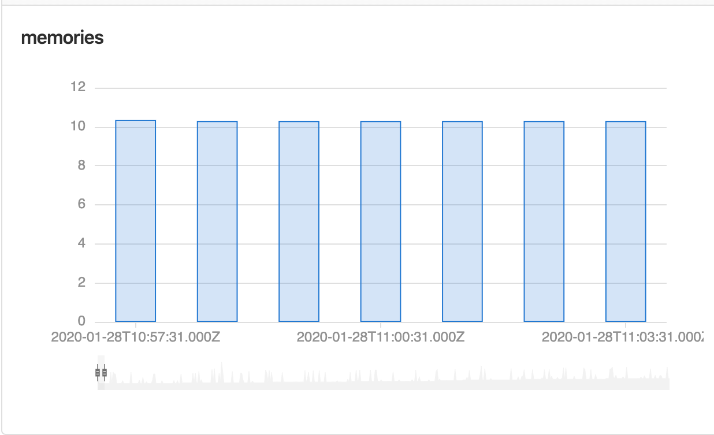
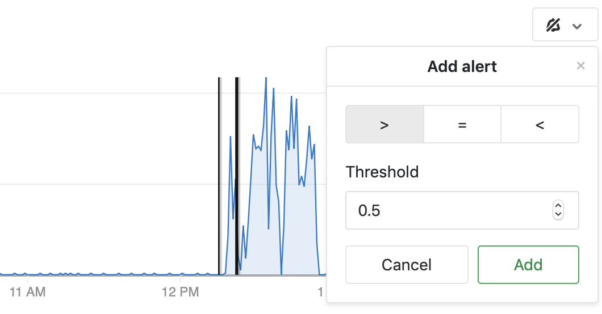
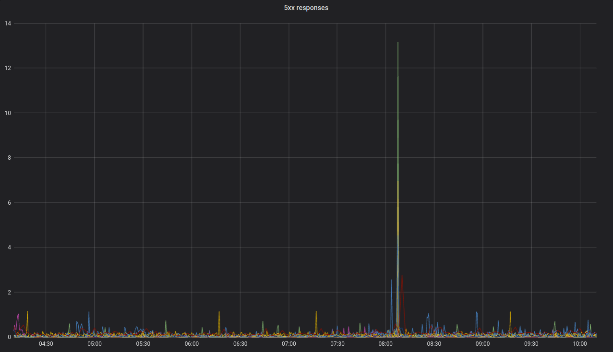

# Prometheus integration

> [Introduced][ce-8935] in GitLab 9.0.

GitLab offers powerful integration with [Prometheus] for monitoring key metrics of your apps, directly within GitLab.
Metrics for each environment are retrieved from Prometheus, and then displayed
within the GitLab interface.



There are two ways to set up Prometheus integration, depending on where your apps are running:

- For deployments on Kubernetes, GitLab can automatically [deploy and manage Prometheus](#managed-prometheus-on-kubernetes).
- For other deployment targets, simply [specify the Prometheus server](#manual-configuration-of-prometheus).

Once enabled, GitLab will automatically detect metrics from known services in the [metric library](#monitoring-cicd-environments). You are also able to [add your own metrics](#adding-additional-metrics-premium) as well.

## Enabling Prometheus Integration

### Managed Prometheus on Kubernetes

> [Introduced](https://gitlab.com/gitlab-org/gitlab-foss/issues/28916) in GitLab 10.5.

GitLab can seamlessly deploy and manage Prometheus on a [connected Kubernetes cluster](../clusters/index.md), making monitoring of your apps easy.

#### Requirements

- A [connected Kubernetes cluster](../clusters/index.md)
- Helm Tiller [installed by GitLab](../clusters/index.md#installing-applications)

#### Getting started

Once you have a connected Kubernetes cluster with Helm installed, deploying a managed Prometheus is as easy as a single click.

1. Go to the **Operations > Kubernetes** page to view your connected clusters
1. Select the cluster you would like to deploy Prometheus to
1. Click the **Install** button to deploy Prometheus to the cluster


#### Getting metrics to display on the Metrics Dashboard

After completing the steps above, you will also need deployments in order to view the
**Operations > Metrics** page. Setting up [Auto DevOps](../../../topics/autodevops/index.md)
will help you to quickly create a deployment:

1. Navigate to your project's **Operations > Kubernetes** page, and ensure that,
   in addition to "Prometheus" and "Helm Tiller", you also have "Runner" and "Ingress"
   installed. Once "Ingress" is installed, copy its endpoint.
1. Navigate to your project's **Settings > CI/CD** page. In the Auto DevOps section,
   select a deployment strategy and save your changes.
1. On the same page, in the Variables section, add a variable named `KUBE_INGRESS_BASE_DOMAIN`
   with the value of the Ingress endpoint you have copied in the previous step. Leave the type
   as "Variable".
1. Navigate to your project's **CI/CD > Pipelines** page, and run a pipeline on any branch.
1. When the pipeline has run successfully, graphs will be available on the **Operations > Metrics** page.


#### Using the Metrics Dashboard

##### Select an environment

The **Environment** dropdown box above the dashboard displays the list of all [environments](#monitoring-cicd-environments).
It enables you to search as you type through all environments and select the one you're looking for.



#### About managed Prometheus deployments

Prometheus is deployed into the `gitlab-managed-apps` namespace, using the [official Helm chart](https://github.com/helm/charts/tree/master/stable/prometheus). Prometheus is only accessible within the cluster, with GitLab communicating through the [Kubernetes API](https://kubernetes.io/docs/concepts/overview/kubernetes-api/).

The Prometheus server will [automatically detect and monitor](https://prometheus.io/docs/prometheus/latest/configuration/configuration/#kubernetes_sd_config) nodes, pods, and endpoints. To configure a resource to be monitored by Prometheus, simply set the following [Kubernetes annotations](https://kubernetes.io/docs/concepts/overview/working-with-objects/annotations/):

- `prometheus.io/scrape` to `true` to enable monitoring of the resource.
- `prometheus.io/port` to define the port of the metrics endpoint.
- `prometheus.io/path` to define the path of the metrics endpoint. Defaults to `/metrics`.

CPU and Memory consumption is monitored, but requires [naming conventions](prometheus_library/kubernetes.html#specifying-the-environment) in order to determine the environment. If you are using [Auto DevOps](../../../topics/autodevops/), this is handled automatically.

The [NGINX Ingress](../clusters/index.md#installing-applications) that is deployed by GitLab to clusters, is automatically annotated for monitoring providing key response metrics: latency, throughput, and error rates.

### Manual configuration of Prometheus

#### Requirements

Integration with Prometheus requires the following:

1. GitLab 9.0 or higher
1. Prometheus must be configured to collect one of the [supported metrics](prometheus_library/index.md)
1. Each metric must be have a label to indicate the environment
1. GitLab must have network connectivity to the Prometheus server

#### Getting started

Installing and configuring Prometheus to monitor applications is fairly straight forward.

1. [Install Prometheus](https://prometheus.io/docs/prometheus/latest/installation/)
1. Set up one of the [supported monitoring targets](prometheus_library/index.md)
1. Configure the Prometheus server to [collect their metrics](https://prometheus.io/docs/prometheus/latest/configuration/configuration/#scrape_config)

#### Configuration in GitLab

The actual configuration of Prometheus integration within GitLab is very simple.
All you will need is the DNS or IP address of the Prometheus server you'd like
to integrate with.

1. Navigate to the [Integrations page](project_services.md#accessing-the-project-services)
1. Click the **Prometheus** service
1. Provide the base URL of your server, for example `http://prometheus.example.com/`
1. Click **Save changes**


## Monitoring CI/CD Environments

Once configured, GitLab will attempt to retrieve performance metrics for any
environment which has had a successful deployment.

GitLab will automatically scan the Prometheus server for metrics from known servers like Kubernetes and NGINX, and attempt to identify individual environment. The supported metrics and scan process is detailed in our [Prometheus Metrics Library documentation](prometheus_library/index.md).

You can view the performance dashboard for an environment by [clicking on the monitoring button](../../../ci/environments.md#monitoring-environments).

### Adding additional metrics **(PREMIUM)**

> [Introduced](https://gitlab.com/gitlab-org/gitlab/-/merge_requests/3799) in [GitLab Premium](https://about.gitlab.com/pricing/) 10.6.

Custom metrics can be monitored by adding them on the monitoring dashboard page. Once saved, they will be displayed on the environment performance dashboard provided that either:

- A [connected Kubernetes cluster](../clusters/add_remove_clusters.md) with the environment scope of `*` is used and [Prometheus installed on the cluster](#enabling-prometheus-integration)
- Prometheus is [manually configured](#manual-configuration-of-prometheus).



A few fields are required:

- **Name**: Chart title
- **Type**: Type of metric. Metrics of the same type will be shown together.
- **Query**: Valid [PromQL query](https://prometheus.io/docs/prometheus/latest/querying/basics/).
- **Y-axis label**: Y axis title to display on the dashboard.
- **Unit label**: Query units, for example `req / sec`. Shown next to the value.

Multiple metrics can be displayed on the same chart if the fields **Name**, **Type**, and **Y-axis label** match between metrics. For example, a metric with **Name** `Requests Rate`, **Type** `Business`, and **Y-axis label** `rec / sec` would display on the same chart as a second metric with the same values. A **Legend label** is suggested if this feature used.

#### Query Variables

GitLab supports a limited set of [CI variables](../../../ci/variables/README.md) in the Prometheus query. This is particularly useful for identifying a specific environment, for example with `CI_ENVIRONMENT_SLUG`. The supported variables are:

- CI_ENVIRONMENT_SLUG
- KUBE_NAMESPACE

There are 2 methods to specify a variable in a query or dashboard:

1. Variables can be specified using the [Liquid template format](https://help.shopify.com/en/themes/liquid/basics), for example `{{ci_environment_slug}}` ([added](https://gitlab.com/gitlab-org/gitlab/-/merge_requests/20793) in GitLab 12.6).
1. You can also enclose it in quotation marks with curly braces with a leading percent, for example `"%{ci_environment_slug}"`. This method is deprecated  though and support will be [removed in the next major release](https://gitlab.com/gitlab-org/gitlab/issues/37990).

### Defining custom dashboards per project

> [Introduced](https://gitlab.com/gitlab-org/gitlab-foss/issues/59974) in GitLab 12.1.

By default, all projects include a GitLab-defined Prometheus dashboard, which
includes a few key metrics, but you can also define your own custom dashboards.

You may create a new file from scratch or duplicate a GitLab-defined Prometheus
dashboard.

NOTE: **Note:**
The custom metrics as defined below do not support alerts, unlike
[additional metrics](#adding-additional-metrics-premium).

#### Adding a new dashboard to your project

You can configure a custom dashboard by adding a new YAML file into your project's
`.gitlab/dashboards/` directory. In order for the dashboards to be displayed on
the project's **Operations > Metrics** page, the files must have a `.yml`
extension and should be present in the project's **default** branch.

For example:

1. Create `.gitlab/dashboards/prom_alerts.yml` under your repository's root
   directory with the following contents:

   ```yaml
   dashboard: 'Dashboard Title'
   panel_groups:
     - group: 'Group Title'
       panels:
         - type: area-chart
           title: "Chart Title"
           y_label: "Y-Axis"
           metrics:
             - id: metric_of_ages
               query_range: 'http_requests_total'
               label: "Metric of Ages"
               unit: "count"
   ```

   The above sample dashboard would display a single area chart. Each file should
   define the layout of the dashboard and the Prometheus queries used to populate
   data.

1. Save the file, commit, and push to your repository. The file must be present in your **default** branch.
1. Navigate to your project's **Operations > Metrics** and choose the custom
   dashboard from the dropdown.

NOTE: **Note:**
Configuration files nested under subdirectories of `.gitlab/dashboards` are not
supported and will not be available in the UI.

#### Duplicating a GitLab-defined dashboard

> - [Introduced](https://gitlab.com/gitlab-org/gitlab/issues/37238) in GitLab 12.7.
> - From [GitLab 12.8 onwards](https://gitlab.com/gitlab-org/gitlab/issues/39505), custom metrics are also duplicated when you duplicate a dashboard.

You can save a complete copy of a GitLab defined dashboard along with all custom metrics added to it.
Resulting `.yml` file can be customized and adapted to your project.
You can decide to save the dashboard `.yml` file in the project's **default** branch or in a
new branch.

1. Click **Duplicate dashboard** in the dashboard dropdown.

   NOTE: **Note:**
   You can duplicate only GitLab-defined dashboards.

1. Enter the file name and other information, such as the new commit's message, and click **Duplicate**.

If you select your **default** branch, the new dashboard becomes immediately available.
If you select another branch, this branch should be merged to your **default** branch first.

#### Dashboard YAML properties

Dashboards have several components:

- Panel groups, which comprise of panels.
- Panels, which support one or more metrics.

The following tables outline the details of expected properties.

**Dashboard properties:**

| Property | Type | Required | Description |
| ------ | ------ | ------ | ------ |
| `dashboard` | string | yes | Heading for the dashboard. Only one dashboard should be defined per file. |
| `panel_groups` | array | yes | The panel groups which should be on the dashboard. |

**Panel group (`panel_groups`) properties:**

| Property | Type | Required | Description |
| ------ | ------ | ------ | ------ |
| `group` | string | required | Heading for the panel group. |
| `priority` | number | optional, defaults to order in file | Order to appear on the dashboard. Higher number means higher priority, which will be higher on the page. Numbers do not need to be consecutive. |
| `panels` | array | required | The panels which should be in the panel group. |

**Panel (`panels`) properties:**

| Property | Type | Required | Description |
| ------ | ------ | ------ | ------- |
| `type` | enum | no, defaults to `area-chart` | Specifies the chart type to use, can be: `area-chart`, `line-chart` or `anomaly-chart`. |
| `title` | string | yes | Heading for the panel. |
| `y_label` | string | no, but highly encouraged | Y-Axis label for the panel. |
| `weight` | number | no, defaults to order in file | Order to appear within the grouping. Lower number means higher priority, which will be higher on the page. Numbers do not need to be consecutive. |
| `metrics` | array | yes | The metrics which should be displayed in the panel. Any number of metrics can be displayed when `type` is `area-chart` or `line-chart`, whereas only 3 can be displayed when `type` is `anomaly-chart`. |

**Metrics (`metrics`) properties:**

| Property | Type | Required | Description |
| ------ | ------ | ------ | ------ |
| `id` | string | no | Used for associating dashboard metrics with database records. Must be unique across dashboard configuration files. Required for [alerting](#setting-up-alerts-for-prometheus-metrics-ultimate) (support not yet enabled, see [relevant issue](https://gitlab.com/gitlab-org/gitlab-foss/issues/60319)). |
| `unit` | string | yes | Defines the unit of the query's return data. |
| `label` | string | no, but highly encouraged | Defines the legend-label for the query. Should be unique within the panel's metrics. |
| `query` | string | yes if `query_range` is not defined | Defines the Prometheus query to be used to populate the chart/panel. If defined, the `query` endpoint of the [Prometheus API](https://prometheus.io/docs/prometheus/latest/querying/api/) will be utilized. |
| `query_range` | string | yes if `query` is not defined | Defines the Prometheus query to be used to populate the chart/panel. If defined, the `query_range` endpoint of the [Prometheus API](https://prometheus.io/docs/prometheus/latest/querying/api/) will be utilized. |

#### Panel types for dashboards

The below panel types are supported in monitoring dashboards.

##### Area or Line Chart

To add an area chart panel type to a dashboard, look at the following sample dashboard file:

```yaml
dashboard: 'Dashboard Title'
panel_groups:
  - group: 'Group Title'
    panels:
      - type: area-chart # or line-chart
        title: 'Area Chart Title'
        y_label: "Y-Axis"
        metrics:
          - id: area_http_requests_total
            query_range: 'http_requests_total'
            label: "Metric of Ages"
            unit: "count"
```

Note the following properties:

| Property | Type | Required | Description |
| ------ | ------ | ------ | ------ |
| type | string | no | Type of panel to be rendered. Optional for area panel types |
| query_range | string | required | For area panel types, you must use a [range query](https://prometheus.io/docs/prometheus/latest/querying/api/#range-queries) |


Starting in [version 12.8](https://gitlab.com/gitlab-org/gitlab/issues/202696), the y-axis values will automatically scale according to the data. Previously, it always started from 0.

##### Anomaly chart

> [Introduced](https://gitlab.com/gitlab-org/gitlab/-/merge_requests/16530) in GitLab 12.5.

To add an anomaly chart panel type to a dashboard, add add a panel with *exactly* 3 metrics.

The first metric represents the current state, and the second and third metrics represent the upper and lower limit respectively:

```yaml
dashboard: 'Dashboard Title'
panel_groups:
  - group: 'Group Title'
    panels:
      - type: anomaly-chart
        title: "Chart Title"
        y_label: "Y-Axis"
        metrics:
          - id: anomaly_requests_normal
            query_range: 'http_requests_total'
            label: "# of Requests"
            unit: "count"
        metrics:
          - id: anomaly_requests_upper_limit
            query_range: 10000
            label: "Max # of requests"
            unit: "count"
        metrics:
          - id: anomaly_requests_lower_limit
            query_range: 2000
            label: "Min # of requests"
            unit: "count"
```

Note the following properties:

| Property | Type | Required | Description |
| ------ | ------ | ------ | ------ |
| type | string | required | Must be `anomaly-chart` for anomaly panel types |
| query_range | yes | required | For anomaly panel types, you must use a [range query](https://prometheus.io/docs/prometheus/latest/querying/api/#range-queries) in every metric. |


##### Column chart

To add a column panel type to a dashboard, look at the following sample dashboard file:

```yaml
dashboard: 'Dashboard Title'
panel_groups:
  - group: 'Group title'
    panels:
      - title: "Column"
        type: "column"
        metrics:
        - id: 1024_memory
          query: 'avg(sum(container_memory_usage_bytes{container_name!="POD",pod_name=~"^%{ci_environment_slug}-([^c].*|c([^a]|a([^n]|n([^a]|a([^r]|r[^y])))).*|)-(.*)",namespace="%{kube_namespace}"}) by (job)) without (job) / count(avg(container_memory_usage_bytes{container_name!="POD",pod_name=~"^%{ci_environment_slug}-([^c].*|c([^a]|a([^n]|n([^a]|a([^r]|r[^y])))).*|)-(.*)",namespace="%{kube_namespace}"}) without (job)) /1024/1024'
          unit: MB
          label: "Memory Usage"
```

Note the following properties:

| Property | Type | Required | Description |
| ------ | ------ | ------ | ------ |
| type | string | yes | Type of panel to be rendered. For column panel types, set to `column` |
| query_range | yes | yes | For column panel types, you must use a [range query](https://prometheus.io/docs/prometheus/latest/querying/api/#range-queries) |



##### Stacked column

> [Introduced](https://gitlab.com/gitlab-org/gitlab/issues/30583) in GitLab 12.8.

To add a stacked column panel type to a dashboard, look at the following sample dashboard file:

```yaml
dashboard: 'Dashboard title'
priority: 1
panel_groups:
- group: 'Group Title'
  priority: 5
  panels:
  - type: 'stacked-column'
    title: "Stacked column"
    y_label: "y label"
    x_label: 'x label'
    metrics:
      - id: memory_1
        query_range: 'memory_query'
        label: "memory query 1"
        unit: "count"
        series_name: 'group 1'
      - id: memory_2
        query_range: 'memory_query_2'
        label: "memory query 2"
        unit: "count"
        series_name: 'group 2'

```


| Property | Type | Required | Description |
| ------ | ------ | ------ | ------ |
| `type` | string | yes | Type of panel to be rendered. For stacked column panel types, set to `stacked-column` |
| `query_range` | yes | yes | For stacked column panel types, you must use a [range query](https://prometheus.io/docs/prometheus/latest/querying/api/#range-queries) |

##### Single Stat

To add a single stat panel type to a dashboard, look at the following sample dashboard file:

```yaml
dashboard: 'Dashboard Title'
panel_groups:
  - group: 'Group Title'
    panels:
      - title: "Single Stat"
        type: "single-stat"
        metrics:
        - id: 10
          query: 'max(go_memstats_alloc_bytes{job="prometheus"})'
          unit: MB
          label: "Total"
```

Note the following properties:

| Property | Type | Required | Description |
| ------ | ------ | ------ | ------ |
| type | string | yes | Type of panel to be rendered. For single stat panel types, set to `single-stat` |
| query | string | yes | For single stat panel types, you must use an [instant query](https://prometheus.io/docs/prometheus/latest/querying/api/#instant-queries) |


##### Heatmaps

> [Introduced](https://gitlab.com/gitlab-org/gitlab/issues/30581) in GitLab 12.5.

To add a heatmap panel type to a dashboard, look at the following sample dashboard file:

```yaml
dashboard: 'Dashboard Title'
panel_groups:
  - group: 'Group Title'
    panels:
      - title: "Heatmap"
        type: "heatmap"
        metrics:
        - id: 10
          query: 'sum(rate(nginx_upstream_responses_total{upstream=~"%{kube_namespace}-%{ci_environment_slug}-.*"}[60m])) by (status_code)'
          unit: req/sec
          label: "Status code"
```

Note the following properties:

| Property | Type | Required | Description |
| ------ | ------ | ------ | ------ |
| type | string | yes | Type of panel to be rendered. For heatmap panel types, set to `heatmap` |
| query_range | yes | yes | For area panel types, you must use a [range query](https://prometheus.io/docs/prometheus/latest/querying/api/#range-queries) |


### View and edit the source file of a custom dashboard

> [Introduced](https://gitlab.com/gitlab-org/gitlab/issues/34779) in GitLab 12.5.

When viewing a custom dashboard of a project, you can view the original
`.yml` file by clicking on **Edit dashboard** button.

### Chart Context Menu

From each of the panels in the dashboard, you can access the context menu by clicking the **{ellipsis_v}** **More actions** dropdown box above the upper right corner of the panel to take actions related to the chart's data.


The options are:

- [View logs](#view-pod-logs-ultimate)
- [Download CSV](#downloading-data-as-csv)
- [Generate link to chart](#embedding-gitlab-managed-kubernetes-metrics)
- [Alerts](#setting-up-alerts-for-prometheus-metrics-ultimate)

### View Pod Logs **(ULTIMATE)**

> [Introduced](https://gitlab.com/gitlab-org/gitlab/issues/122013) in GitLab 12.8.

If you have [Kubernetes Pod Logs](../clusters/kubernetes_pod_logs.md) enabled, you can navigate from the charts in the dashboard to view Pod Logs by clicking on the context menu in the upper-right corner.

If you use the **Timeline zoom** function at the bottom of the chart, logs will narrow down to the time range you selected.

### Downloading data as CSV

Data from Prometheus charts on the metrics dashboard can be downloaded as CSV.

### Setting up alerts for Prometheus metrics **(ULTIMATE)**

#### Managed Prometheus instances

> [Introduced](https://gitlab.com/gitlab-org/gitlab/-/merge_requests/6590) in [GitLab Ultimate](https://about.gitlab.com/pricing/) 11.2 for [custom metrics](#adding-additional-metrics-premium), and 11.3 for [library metrics](prometheus_library/metrics.md).

For managed Prometheus instances using auto configuration, alerts for metrics [can be configured](#adding-additional-metrics-premium) directly in the performance dashboard.

To set an alert:

1. Click on the ellipsis icon in the top right corner of the metric you want to create the alert for.
1. Choose **Alerts**
1. Set threshold and operator.
1. Click **Add** to save and activate the alert.



To remove the alert, click back on the alert icon for the desired metric, and click **Delete**.

#### External Prometheus instances

> [Introduced](https://gitlab.com/gitlab-org/gitlab/issues/9258) in [GitLab Ultimate](https://about.gitlab.com/pricing/) 11.8.

For manually configured Prometheus servers, a notify endpoint is provided to use with Prometheus webhooks. If you have manual configuration enabled, an **Alerts** section is added to **Settings > Integrations > Prometheus**. This contains the *URL* and *Authorization Key*. The **Reset Key** button will invalidate the key and generate a new one.


To send GitLab alert notifications, copy the *URL* and *Authorization Key* into the [`webhook_configs`](https://prometheus.io/docs/alerting/configuration/#webhook_config) section of your Prometheus Alertmanager configuration:

```yaml
receivers:
  name: gitlab
  webhook_configs:
  - http_config:
      bearer_token: 9e1cbfcd546896a9ea8be557caf13a76
    send_resolved: true
    url: http://192.168.178.31:3001/root/manual_prometheus/prometheus/alerts/notify.json
  ...
```

In order for GitLab to associate your alerts with an [environment](../../../ci/environments.md), you need to configure a `gitlab_environment_name` label on the alerts you set up in Prometheus. The value of this should match the name of your Environment in GitLab.

### Taking action on incidents **(ULTIMATE)**

>- [Introduced](https://gitlab.com/gitlab-org/gitlab/issues/4925) in [GitLab Ultimate](https://about.gitlab.com/pricing/) 11.11.
>- [From GitLab Ultimate 12.5](https://gitlab.com/gitlab-org/gitlab/issues/13401), when GitLab receives a recovery alert, it will automatically close the associated issue.

Alerts can be used to trigger actions, like open an issue automatically (enabled by default since `12.1`). To configure the actions:

1. Navigate to your project's **Settings > Operations > Incidents**.
1. Enable the option to create issues.
1. Choose the [issue template](../description_templates.md) to create the issue from.
1. Optionally, select whether to send an email notification to the developers of the project.
1. Click **Save changes**.

Once enabled, an issue will be opened automatically when an alert is triggered which contains values extracted from [alert's payload](https://prometheus.io/docs/alerting/configuration/#webhook_config
):

- Issue author: `GitLab Alert Bot`
- Issue title: Extract from `annotations/title`, `annotations/summary` or `labels/alertname`
- Alert `Summary`: A list of properties
  - `starts_at`: Alert start time via `startsAt`
  - `full_query`: Alert query extracted from `generatorURL`
  - Optional list of attached annotations extracted from `annotations/*`
- Alert [GFM](../../markdown.md): GitLab Flavored Markdown from `annotations/gitlab_incident_markdown`

When GitLab receives a **Recovery Alert**, it will automatically close the associated issue. This action will be recorded as a system message on the issue indicated that it was closed automatically by the GitLab Alert bot.

To further customize the issue, you can add labels, mentions, or any other supported [quick action](../quick_actions.md) in the selected issue template, which will apply to all incidents. To limit quick actions or other information to only specific types of alerts, use the `annotations/gitlab_incident_markdown` field.

Since [version 12.2](https://gitlab.com/gitlab-org/gitlab-foss/issues/63373), GitLab will tag each incident issue with the `incident` label automatically. If the label does not yet exist, it will be created automatically as well.

If the metric exceeds the threshold of the alert for over 5 minutes, an email will be sent to all [Maintainers and Owners](../../permissions.md#project-members-permissions) of the project.

## Determining the performance impact of a merge

> - [Introduced][ce-10408] in GitLab 9.2.
> - GitLab 9.3 added the [numeric comparison](https://gitlab.com/gitlab-org/gitlab-foss/issues/27439) of the 30 minute averages.

Developers can view the performance impact of their changes within the merge
request workflow.

NOTE: **Note:**
Requires [Kubernetes](prometheus_library/kubernetes.md) metrics.

When a source branch has been deployed to an environment, a sparkline and
numeric comparison of the average memory consumption will appear. On the
sparkline, a dot indicates when the current changes were deployed, with up to 30 minutes of
performance data displayed before and after. The comparison shows the difference
between the 30 minute average before and after the deployment. This information
is updated after each commit has been deployed.

Once merged and the target branch has been redeployed, the metrics will switch
to show the new environments this revision has been deployed to.

Performance data will be available for the duration it is persisted on the
Prometheus server.


## Embedding metric charts within GitLab Flavored Markdown

### Embedding GitLab-managed Kubernetes metrics

> [Introduced][ce-29691] in GitLab 12.2.

It is possible to display metrics charts within [GitLab Flavored Markdown](../../markdown.md#gitlab-flavored-markdown-gfm). The maximum number of embeds allowed in a GitLab Flavored Markdown field is 100.

NOTE: **Note:**
Requires [Kubernetes](prometheus_library/kubernetes.md) metrics.

To display a metric chart, include a link of the form `https://<root_url>/<project>/-/environments/<environment_id>/metrics`.

A single chart may also be embedded. You can generate a link to the chart via the dropdown located on the right side of the chart:


The following requirements must be met for the metric to unfurl:

- The `<environment_id>` must correspond to a real environment.
- Prometheus must be monitoring the environment.
- The GitLab instance must be configured to receive data from the environment.
- The user must be allowed access to the monitoring dashboard for the environment ([Reporter or higher](../../permissions.md)).
- The dashboard must have data within the last 8 hours.

 If all of the above are true, then the metric will unfurl as seen below:


### Embedding metrics in issue templates

It is also possible to embed either the default dashboard metrics or individual metrics in issue templates. For charts to render side-by-side, links to the entire metrics dashboard or individual metrics should be separated by either a comma or a space.


### Embedding Grafana charts

Grafana metrics can be embedded in [GitLab Flavored Markdown](../../markdown.md).

#### Embedding charts via Grafana Rendered Images

It is possible to embed live [Grafana](https://docs.gitlab.com/omnibus/settings/grafana.html) charts in issues, as a [direct linked rendered image](https://grafana.com/docs/grafana/latest/reference/share_panel/#direct-link-rendered-image).

The sharing dialog within Grafana provides the link, as highlighted below.


NOTE: **Note:**
For this embed to display correctly, the Grafana instance must be available to the target user, either as a public dashboard or on the same network.

Copy the link and add an image tag as [inline HTML](../../markdown.md#inline-html) in your Markdown. You may tweak the query parameters as required. For instance, removing the `&from=` and `&to=` parameters will give you a live chart. Here is example markup for a live chart from GitLab's public dashboard:

```html

```

This will render like so:



#### Embedding charts via integration with Grafana HTTP API

> [Introduced](https://gitlab.com/gitlab-org/gitlab/issues/31376) in GitLab 12.5.

Each project can support integration with one Grafana instance. This configuration allows a user to copy a link to a panel in Grafana, then paste it into a GitLab Markdown field. The chart will be rendered in the GitLab chart format.

Prerequisites for embedding from a Grafana instance:

1. The datasource must be a Prometheus instance.
1. The datasource must be proxyable, so the HTTP Access setting should be set to `Server`.


##### Setting up the Grafana integration

1. [Generate an Admin-level API Token in Grafana.](https://grafana.com/docs/grafana/latest/http_api/auth/#create-api-token)
1. In your GitLab project, navigate to **Settings > Operations > Grafana Authentication**.
1. To enable the integration, check the "Active" checkbox.
1. For "Grafana URL", enter the base URL of the Grafana instance.
1. For "API Token", enter the Admin API Token you just generated.
1. Click **Save Changes**.

##### Generating a link to a chart

1. In Grafana, navigate to the dashboard you wish to embed a panel from.
   
1. In the upper-left corner of the page, select a specific value for each variable required for the queries in the chart.
   
1. In Grafana, click on a panel's title, then click **Share** to open the panel's sharing dialog to the **Link** tab.
1. If your Prometheus queries use Grafana's custom template variables, ensure that "Template variables" and "Current time range" options are toggled to **On**. Of Grafana global template variables, only `$__interval`, `$__from`, and `$__to` are currently supported.
   
1. Click **Copy** to copy the URL to the clipboard.
1. In GitLab, paste the URL into a Markdown field and save. The chart will take a few moments to render.
   

## Troubleshooting

If the "No data found" screen continues to appear, it could be due to:

- No successful deployments have occurred to this environment.
- Prometheus does not have performance data for this environment, or the metrics
  are not labeled correctly. To test this, connect to the Prometheus server and
  [run a query](prometheus_library/kubernetes.html#metrics-supported), replacing `$CI_ENVIRONMENT_SLUG`
  with the name of your environment.
- You may need to re-add the GitLab predefined common metrics. This can be done by running the [import common metrics rake task](../../../administration/raketasks/maintenance.md#import-common-metrics).

[autodeploy]: ../../../topics/autodevops/index.md#auto-deploy
[kubernetes]: https://kubernetes.io
[kube]: ./kubernetes.md
[prometheus-k8s-sd]: https://prometheus.io/docs/operating/configuration/#<kubernetes_sd_config>
[prometheus]: https://prometheus.io
[gitlab-prometheus-k8s-monitor]: ../../../administration/monitoring/prometheus/index.md#configuring-prometheus-to-monitor-kubernetes
[prometheus-docker-image]: https://hub.docker.com/r/prom/prometheus/
[prometheus-yml]:samples/prometheus.yml
[gitlab.com-ip-range]: https://gitlab.com/gitlab-com/infrastructure/issues/434
[ci-environment-slug]: ../../../ci/variables/#predefined-environment-variables
[ce-8935]: https://gitlab.com/gitlab-org/gitlab-foss/-/merge_requests/8935
[ce-10408]: https://gitlab.com/gitlab-org/gitlab-foss/-/merge_requests/10408
[ce-29691]: https://gitlab.com/gitlab-org/gitlab-foss/-/merge_requests/29691
[promgldocs]: ../../../administration/monitoring/prometheus/index.md
