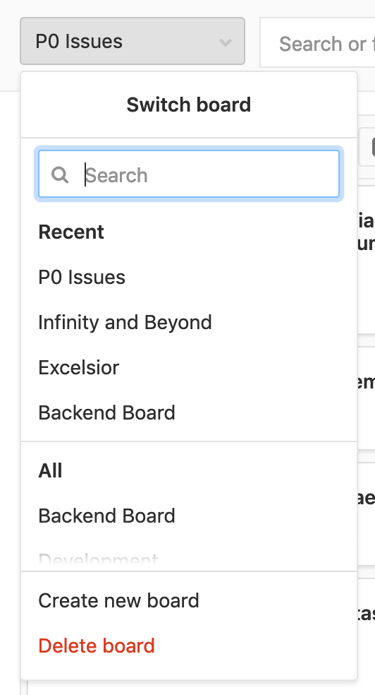
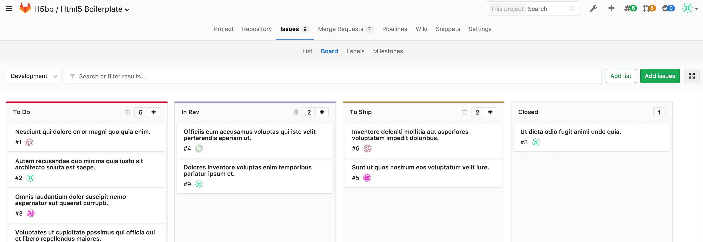
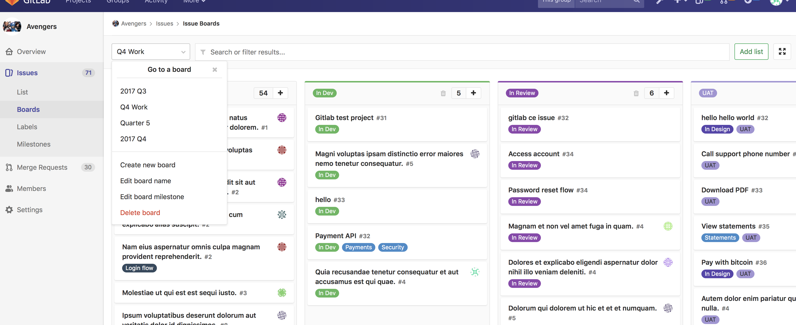
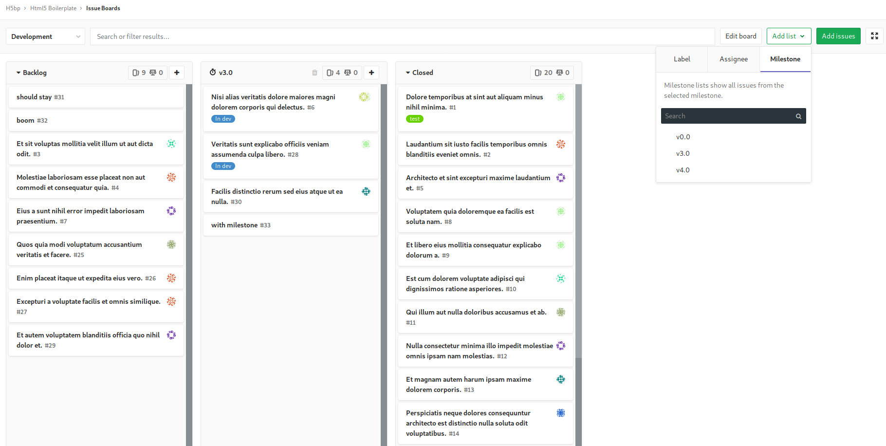

# Issue Boards

> [Introduced][ce-5554] in [GitLab 8.11](https://about.gitlab.com/2016/08/22/gitlab-8-11-released/#issue-board).

The GitLab Issue Board is a software project management tool used to plan,
organize, and visualize a workflow for a feature or product release.
It can be used as a [Kanban] or a [Scrum] board.

## Overview

The Issue Board builds on GitLab's existing
[issue tracking functionality](issues/index.md#issue-tracker) and
leverages the power of [labels](labels.md) by utilizing them as lists of the scrum board.

With the Issue Board you can have a different view of your issues while
maintaining the same filtering and sorting abilities you see across the
issue tracker. An Issue Board is based on its project's label structure, therefore, it
applies the same descriptive labels to indicate placement on the board, keeping
consistency throughout the entire development lifecycle.

An Issue Board shows you what issues your team is working on, who is assigned to each,
and where in the workflow those issues are.

You create issues, host code, perform reviews, build, test,
and deploy from one single platform. Issue Boards help you to visualize
and manage the entire process _in_ GitLab.

With [Multiple Issue Boards](#use-cases-for-multiple-issue-boards), available
only in [GitLab Enterprise Edition](#features-per-tier),
you go even further, as you can not only keep yourself and your project
organized from a broader perspective with one Issue Board per project,
but also allow your team members to organize their own workflow by creating
multiple Issue Boards within the same project.

For a visual overview, see our [Issue Board feature page](https://about.gitlab.com/features/issueboard/)
on about.gitlab.com or our [video introduction to Issue Boards](https://www.youtube.com/watch?v=UWsJ8tkHAa8).

## Use cases

There are many ways to use GitLab Issue Boards tailored to your own preferred workflow.
Here are some common use cases for Issue Boards.

### Use cases for a single Issue Board

GitLab Workflow allows you to discuss proposals in issues, categorize them
with labels, and from there organize and prioritize them with Issue Boards.

For example, let's consider this simplified development workflow:

1. You have a repository hosting your app's codebase
and your team actively contributing to code
1. Your **backend** team starts working a new
implementation, gathers feedback and approval, and pass it over to **frontend**
1. When frontend is complete, the new feature is deployed to **staging** to be tested
1. When successful, it is deployed to **production**

If we have the labels "**backend**", "**frontend**", "**staging**", and
"**production**", and an Issue Board with a list for each, we can:

- Visualize the entire flow of implementations since the
beginning of the development lifecycle until deployed to production
- Prioritize the issues in a list by moving them vertically
- Move issues between lists to organize them according to the labels you've set
- Add multiple issues to lists in the board by selecting one or more existing issues

### Use cases for Multiple Issue Boards

With [Multiple Issue Boards](#multiple-issue-boards), available only in
[GitLab Enterprise Edition](https://about.gitlab.com/pricing/),
each team can have their own board to organize their workflow individually.

#### Scrum team

With Multiple Issue Boards, each team has one board. Now you can move issues through each
part of the process. For instance: **To Do**, **Doing**, and **Done**.

#### Organization of topics

Create lists to order things by topic and quickly change them between topics or groups,
such as between **UX**, **Frontend**, and **Backend**. The changes will be reflected across boards,
as changing lists will update the label accordingly.

#### Advanced team handover

For example, suppose we have a UX team with an Issue Board that contains:

- **To Do**
- **Doing**
- **Frontend**

When done with something, they move the card to **Frontend**. The Frontend team's board looks like:

- **Frontend**
- **Doing**
- **Done**

Cards finished by the UX team will automatically appear in the **Frontend** column when they're ready for them.

NOTE: **Note:**
For a broader use case, please see the blog post
[GitLab Workflow, an Overview](https://about.gitlab.com/2016/10/25/gitlab-workflow-an-overview/#gitlab-workflow-use-case-scenario).
For a real use case example, you can read why
[Codepen decided to adopt Issue Boards](https://about.gitlab.com/2017/01/27/codepen-welcome-to-gitlab/#project-management-everything-in-one-place)
to improve their workflow with multiple boards.

#### Quick assignments

Create lists for each of your team members and quickly drag-and-drop issues onto each team member.

## Permissions

[Developers and up](../permissions.md) can use all the functionality of the
Issue Board, that is, create or delete lists and drag issues from one list to another.

## Issue Board terminology

- **Issue Board** - Each board represents a unique view for your issues. It can have multiple lists with each list consisting of issues represented by cards.
- **List** - A column on the issue board that displays issues matching certain attributes. In addition to the default lists of 'Open' and 'Closed' issue, each additional list will show issues matching your chosen label or assignee. On the top of that list you can see the number of issues that belong to it.
   - **Label list**: a list based on a label. It shows all opened issues with that label.
   - **Assignee list**: a list which includes all issues assigned to a user.
   - **Milestone list**: a list which includes all issues with that milestone.
   - **Open** (default): shows all open issues that do not belong to one of the other lists. Always appears as the leftmost list.
   - **Closed** (default): shows all closed issues. Always appears as the rightmost list.
- **Card** - A box in the list that represents an individual issue. The information you can see on a card consists of the issue number, the issue title, the assignee, and the labels associated with the issue. You can drag cards from one list to another to change their label or assignee from that of the source list to that of the destination list.

## Actions you can take on an Issue Board

- [Create a new list](#creating-a-new-list).
- [Delete an existing list](#deleting-a-list).
- Drag issues between lists.
- Re-order issues in lists.
- Drag and reorder the lists themselves.
- Change issue labels on-the-fly while dragging issues between lists.
- Close an issue if you drag it to the **Done** list.
- Create a new list from a non-existing label by [creating the label on-the-fly](#creating-a-new-list)
  within the Issue Board.
- [Filter issues](#filtering-issues) that appear across your Issue Board.

If you are not able to perform one or more of the things above, make sure you
have the right [permissions](#permissions).

## First time using the Issue Board

The first time you navigate to your Issue Board, you will be presented with
a default list (**Done**) and a welcoming message that gives
you two options. You can either create a predefined set of labels and create
their corresponding lists to the Issue Board or opt-out and use your own lists.

If you choose to use and create the predefined lists, they will appear as empty
because the labels associated to them will not exist up until that moment,
which means the system has no way of populating them automatically. That's of
course if the predefined labels don't already exist. If any of them does exist,
the list will be created and filled with the issues that have that label.

## Creating a new list

Create a new list by clicking on the **Add list** button at the upper
right corner of the Issue Board.

Simply choose the label or user to create the list from. The new list will be inserted
at the end of the lists, before **Done**. Moving and reordering lists is as
easy as dragging them around.

To create a list for a label that doesn't yet exist, simply create the label by
choosing **Create new label**. The label will be created on-the-fly and it will
be immediately added to the dropdown. You can now choose it to create a list.

## Deleting a list

To delete a list from the Issue Board use the small trash icon that is present
in the list's heading. A confirmation dialog will appear for you to confirm.

Deleting a list doesn't have any effect in issues and labels, it's just the
list view that is removed. You can always add it back later if you need.

## Adding issues to a list

You can add issues to a list by clicking the **Add issues** button that is
present in the upper right corner of the Issue Board. This will open up a modal
window where you can see all the issues that do not belong to any list.

Select one or more issues by clicking on the cards and then click **Add issues**
to add them to the selected list. You can limit the issues you want to add to
the list by filtering by author, assignee, milestone and label.

## Removing an issue from a list

Removing an issue from a list can be done by clicking on the issue card and then
clicking the **Remove from board** button in the sidebar. Under the hood, the
respective label is removed, and as such it's also removed from the list and the
board itself.

## Issue ordering in a list

When visiting a board, issues appear ordered in any list. You are able to change
that order simply by dragging and dropping the issues. The changed order will be saved
to the system so that anybody who visits the same board later will see the reordering,
with some exceptions.

The first time a given issue appears in any board (i.e. the first time a user
loads a board containing that issue), it will be ordered with
respect to other issues in that list according to [Priority order](labels.md#label-priority).

At that point, that issue will be assigned a relative order value by the system
representing its relative order with respect to the other issues in the list. Any time
you drag-and-drop reorder that issue, its relative order value will change accordingly.

Also, any time that issue appears in any board when it is loaded by a user,
the updated relative order value will be used for the ordering. (It's only the first
time an issue appears that it takes from the Priority order mentioned above.) This means that
if issue `A` is drag-and-drop reordered to be above issue `B` by any user in
a given board inside your GitLab instance, any time those two issues are subsequently
loaded in any board in the same instance (could be a different project board or a different group board, for example),
that ordering will be maintained.

## Filtering issues

You should be able to use the filters on top of your Issue Board to show only
the results you want. This is similar to the filtering used in the issue tracker
since the metadata from the issues and labels are re-used in the Issue Board.

You can filter by author, assignee, milestone and label.

## Creating workflows

By reordering your lists, you can create workflows. As lists in Issue Boards are
based on labels, it works out of the box with your existing issues. So if you've
already labeled things with 'Backend' and 'Frontend', the issue will appear in
the lists as you create them. In addition, this means you can easily move
something between lists by changing a label.

A typical workflow of using the Issue Board would be:

1. You have [created](labels.md#creating-labels) and [prioritized](labels.md#label-priority)
   labels so that you can easily categorize your issues.
1. You have a bunch of issues (ideally labeled).
1. You visit the Issue Board and start [creating lists](#creating-a-new-list) to
   create a workflow.
1. You move issues around in lists so that your team knows who should be working
   on what issue.
1. When the work by one team is done, the issue can be dragged to the next list
   so someone else can pick up.
1. When the issue is finally resolved, the issue is moved to the **Done** list
   and gets automatically closed.

For instance you can create a list based on the label of 'Frontend' and one for
'Backend'. A designer can start working on an issue by adding it to the
'Frontend' list. That way, everyone knows that this issue is now being
worked on by the designers. Then, once they're done, all they have to do is
drag it over to the next list, 'Backend', where a backend developer can
eventually pick it up. Once they’re done, they move it to **Done**, to close the
issue.

This process can be seen clearly when visiting an issue since with every move
to another list the label changes and a system not is recorded.

## Sum of Issue Weights **[STARTER]**

The top of each list indicates the sum of issue weights for the issues that
belong to that list. This is useful when using boards for capacity allocation,
especially in combination with [assignee lists](#assignee-lists).

## Multiple Issue Boards **[STARTER]**

> Introduced in [GitLab Enterprise Edition 8.13](https://about.gitlab.com/2016/10/22/gitlab-8-13-released/#multiple-issue-boards-ee).

Multiple Issue Boards, as the name suggests, allow for more than one Issue Board
for a given project or group. This is great for large projects with more than one team
or in situations where a repository is used to host the code of multiple
products.

Clicking on the current board name in the upper left corner will reveal a
menu from where you can create another Issue Board and rename or delete the
existing one.

NOTE: **Note:**
The Multiple Issue Boards feature is available for
**projects in GitLab Starter Edition** and for **groups in GitLab Premium Edition**.

## Configurable Issue Boards **[STARTER]**

> Introduced in [GitLab Starter Edition 10.2](https://about.gitlab.com/2017/11/22/gitlab-10-2-released/#issue-boards-configuration).

An Issue Board can be associated with GitLab [Milestone](milestones/index.md#milestones),
[Labels](labels.md), Assignee and Weight
which will automatically filter the Board issues according to these fields.
This allows you to create unique boards according to your team's need.

You can define the scope of your board when creating it or by clicking on the "Edit board" button. Once a milestone, assignee or weight is assigned to an Issue Board, you will no longer be able to filter
through these in the search bar. In order to do that, you need to remove the desired scope (e.g. milestone, assignee or weight) from the Issue Board.

If you don't have editing permission in a board, you're still able to see the configuration by clicking on "View scope".

## Focus mode **[STARTER]**

> Introduced in [GitLab Starter 9.1](https://about.gitlab.com/2017/04/22/gitlab-9-1-released/#issue-boards-focus-mode-ees-eep).

Click the button at the top right to toggle focus mode on and off. In focus mode, the navigation UI is hidden, allowing you to focus on issues in the board.

## Group Issue Boards **[PREMIUM]**

> Introduced in [GitLab Premium 10.0](https://about.gitlab.com/2017/09/22/gitlab-10-0-released/#group-issue-boards).

Accessible at the group navigation level, a group issue board offers the same features as a project-level board,
but it can display issues from all projects in that
group and its descendant subgroups. Similarly, you can only filter by group labels for these
boards. When updating milestones and labels for an issue through the sidebar update mechanism, again only
group-level objects are available.

NOTE: **Note:**
Multiple group issue boards were originally introduced in [GitLab 10.0 Premium](https://about.gitlab.com/2017/09/22/gitlab-10-0-released/#group-issue-boards) and
one group issue board per group was made available in GitLab 10.6 Core. 

## Assignee lists **[PREMIUM]**

> [Introduced](https://gitlab.com/gitlab-org/gitlab-ee/issues/5784) in GitLab 11.0 Premium.

Like a regular list that shows all issues that have the list label, you can add
an assignee list that shows all issues assigned to the given user.
You can have a board with both label lists and assignee lists. To add an
assignee list:

1. Click **Add list**.
1. Select the **Assignee** tab.
1. Search and click on the user you want to add as an assignee.

Now that the assignee list is added, you can assign or unassign issues to that user
by [dragging issues](#dragging-issues-between-lists) to and/or from an assignee list.
To remove an assignee list, just as with a label list, click the trash icon.

## Milestone lists **[PREMIUM]**

> [Introduced](https://gitlab.com/gitlab-org/gitlab-ee/issues/6469) in GitLab 11.2 Premium.

As of 11.2, you're also able to create lists of a milestone. As the name states,
these are lists that filter issues by the assigned milestone, giving you more
freedom and visibility on the Issue Board. To do so:

1. Click **Add list**.
1. Select the **Milestone** tab.
1. Search and click on the milestone.

Similar to the assignee lists, you're now able to [drag issues](#dragging-issues-between-lists)
to and/or from a milestone list to manipulate the milestone of the dragged issues.
As on another list types, click on the trash icon to remove it.

## Dragging issues between lists

When dragging issues between lists, different behavior occurs depending on the source list and the target list.

|                            | To Open            | To Closed    | To label `B` list            | To assignee `Bob` list                | To milestone `2.0` list        |
|----------------------------|--------------------|--------------|------------------------------|---------------------------------------|--------------------------------|
| From Open                  | -                  | Issue closed | `B` added                    | `Bob` assigned                        | `2.0`  added                   |
| From Closed                | Issue reopened     | -            | Issue reopened `B` added | Issue reopened `Bob` assigned     | Issue reopened `2.0` added |
| From label `A` list        | `A` removed        | Issue closed | `A` removed `B` added    | `Bob` assigned                        | `2.0` added                    |
| From assignee `Alice` list | `Alice` unassigned | Issue closed | `B` added                    | `Alice` unassigned `Bob` assigned | `2.0` added                    |
| From milestone `1.0` list  | `1.0` removed      | Issue closed | `B` added                    | `Bob` assigned                    | `1.0` removed `2.0` added  |

## Features per tier

Different issue board features are available in different [GitLab tiers](https://about.gitlab.com/pricing/), as shown in the following table:

| Tier     | Number of Project Issue Boards | Number of Group Issue Boards | Configurable Issue Boards | Assignee Lists |
|----------|--------------------------------|------------------------------|---------------------------|----------------|
| Core     | 1                              | 1                            | No                        | No             |
| Starter  | Multiple                       | 1                            | Yes                       | No             |
| Premium  | Multiple                       | Multiple                     | Yes                       | Yes            |
| Ultimate | Multiple                       | Multiple                     | Yes                       | Yes            |

## Tips

A few things to remember:

- Moving an issue between lists removes the label from the list it came from
  and adds the label from the list it goes to.
- An issue can exist in multiple lists if it has more than one label.
- Lists are populated with issues automatically if the issues are labeled.
- Clicking on the issue title inside a card will take you to that issue.
- Clicking on a label inside a card will quickly filter the entire Issue Board
  and show only the issues from all lists that have that label.
- For performance and visibility reasons, each list shows the first 20 issues
  by default. If you have more than 20 issues start scrolling down and the next
  20 will appear.

[ce-5554]: https://gitlab.com/gitlab-org/gitlab-ce/merge_requests/5554
[scrum]: https://en.wikipedia.org/wiki/Scrum_(software_development)
[kanban]: https://en.wikipedia.org/wiki/Kanban_(development)
