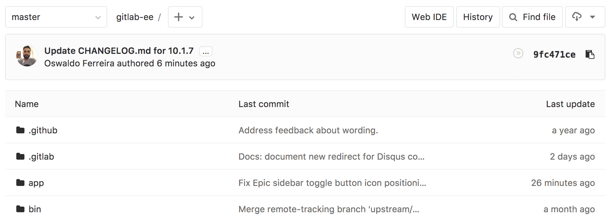
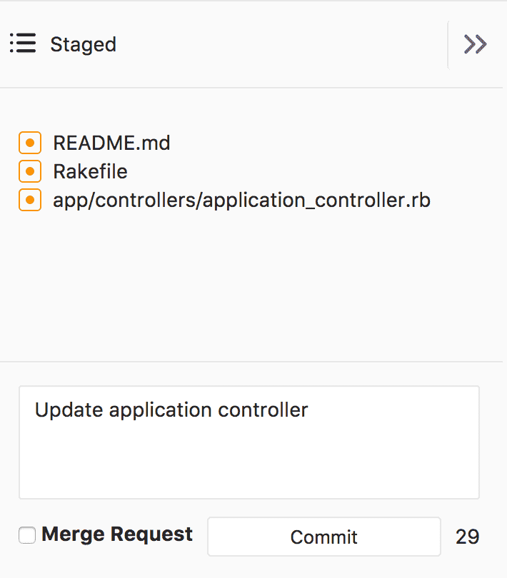
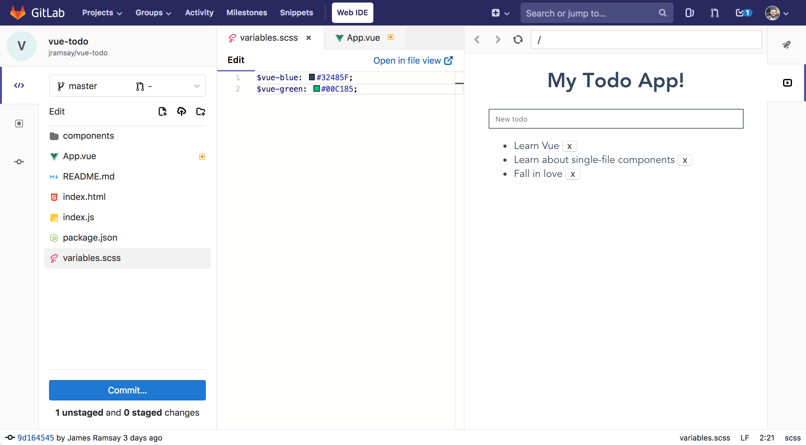

# Web IDE

> [Introduced](https://gitlab.com/gitlab-org/gitlab-ee/issues/4539) in [GitLab Ultimate][ee] 10.4.
> [Brought to GitLab Core](https://gitlab.com/gitlab-org/gitlab-ce/issues/44157) in 10.7.

The Web IDE editor makes it faster and easier to contribute changes to your
projects by providing an advanced editor with commit staging.

## Open the Web IDE

The Web IDE can be opened when viewing a file, from the repository file list,
and from merge requests.



## File finder

> [Introduced](https://gitlab.com/gitlab-org/gitlab-ce/merge_requests/18323) in [GitLab Core][ce] 10.8.

The file finder allows you to quickly open files in the current branch by
searching. The file finder is launched using the keyboard shortcut `Command-p`,
`Control-p`, or `t` (when editor is not in focus). Type the filename or
file path fragments to start seeing results.

## Syntax highlighting

As expected from an IDE, syntax highlighting for many languages within 
the Web IDE will make your direct editing even easier.

The Web IDE currently provides:

- Basic syntax colorization for a variety of programming, scripting and markup 
languages such as XML, PHP, C#, C++, Markdown, Java, VB, Batch, Python, Ruby 
and Objective-C.  
- IntelliSense and validation support (displaying errors and warnings, providing 
smart completions, formatting, and outlining) for some languages. For example: 
TypeScript, JavaScript, CSS, LESS, SCSS, JSON and HTML. 

Because the Web IDE is based on the [Monaco Editor](https://microsoft.github.io/monaco-editor/), 
you can find a more complete list of supported languages in the 
[Monaco languages](https://github.com/Microsoft/monaco-languages) repository.  

NOTE: **Note:**
Single file editing is based on the [Ace Editor](https://ace.c9.io).

## Stage and commit changes

After making your changes, click the Commit button in the bottom left to
review the list of changed files. Click on each file to review the changes and
click the tick icon to stage the file.

Once you have staged some changes, you can add a commit message and commit the
staged changes. Unstaged changes will not be commited.



## Reviewing changes

Before you commit your changes, you can compare them with the previous commit
by switching to the review mode or selecting the file from the staged files
list.

An additional review mode is available when you open a merge request, which
shows you a preview of the merge request diff if you commit your changes.

## View CI job logs

> [Introduced](https://gitlab.com/gitlab-org/gitlab-ce/merge_requests/19279) in [GitLab Core][ce] 11.0.

The Web IDE can be used to quickly fix failing tests by opening the branch or
merge request in the Web IDE and opening the logs of the failed job. The status
of all jobs for the most recent pipeline and job traces for the current commit
can be accessed by clicking the **Pipelines** button in the top right.

The pipeline status is also shown at all times in the status bar in the bottom
left.

## Switching merge requests

> [Introduced](https://gitlab.com/gitlab-org/gitlab-ce/merge_requests/19318) in [GitLab Core][ce] 11.0.

Switching between your authored and assigned merge requests can be done without
leaving the Web IDE. Click the dropdown in the top of the sidebar to open a list
of merge requests. You will need to commit or discard all your changes before
switching to a different merge request.

## Switching branches

> [Introduced](https://gitlab.com/gitlab-org/gitlab-ce/merge_requests/20850) in [GitLab Core][ce] 11.2.

Switching between branches of the current project repository can be done without
leaving the Web IDE. Click the dropdown in the top of the sidebar to open a list
of branches. You will need to commit or discard all your changes before
switching to a different branch.

## Client Side Evaluation

> [Introduced](https://gitlab.com/gitlab-org/gitlab-ce/merge_requests/19764) in [GitLab Core][ce] 11.2.

The Web IDE can be used to preview JavaScript projects right in the browser.
This feature uses CodeSandbox to compile and bundle the JavaScript used to
preview the web application.



Additionally, for public projects an `Open in CodeSandbox` button is available
to transfer the contents of the project into a public CodeSandbox project to
quickly share your project with others.

### Enabling Client Side Evaluation

The Client Side Evaluation feature needs to be enabled in the GitLab instances
admin settings. Client Side Evaluation is enabled for all projects on
GitLab.com


Once it has been enabled in application settings, projects with a
`package.json` file and a `main` entry point can be previewed inside of the Web
IDE. An example `package.json` is below.

```json
{
  "main": "index.js",
  "dependencies": {
    "vue": "latest"
  }
}
```

## Interactive Web Terminals for the Web IDE **[ULTIMATE]**

> [Introduced](https://gitlab.com/gitlab-org/gitlab-ee/issues/5426) in [GitLab Ultimate](https://about.gitlab.com/pricing/) 10.6.

CAUTION: **Warning:**
Interactive Web Terminals for the Web IDE is currently in **Beta**.

[Interactive web terminals](../../../ci/interactive_web_terminal/index.md)
give the user access to a terminal to interact with the Runner directly from
GitLab, including through the Web IDE.

Only project [**maintainers**](../../permissions.md#project-members-permissions)
can run Interactive Web Terminals through the Web IDE.

NOTE: **Note:**
GitLab.com does not support interactive web terminal at the moment – neither
using shared GitLab.com runners nor your own runners. Please follow
[this issue](https://gitlab.com/gitlab-org/gitlab-ce/issues/52611) for
progress.

### Runner configuration

Some things need to be configured in the runner for the interactive web terminal
to work:

- The Runner needs to have 
  [`[session_server]` configured properly](https://docs.gitlab.com/runner/configuration/advanced-configuration.html#the-session_server-section).
- If you are using a reverse proxy with your GitLab instance, web terminals need to be
  [enabled](../../../administration/integration/terminal.md#enabling-and-disabling-terminal-support). **[ULTIMATE ONLY]**

If you have the terminal open and the job has finished with its tasks, the
terminal will block the job from finishing for the duration configured in
[`[session_server].terminal_max_retention_time`](https://docs.gitlab.com/runner/configuration/advanced-configuration.html#the-session_server-section)
until you close the terminal window.

NOTE: **Note:** Not all executors are
[supported](https://docs.gitlab.com/runner/executors/#compatibility-chart)

### Web IDE configuration file

In order to enable the Web IDE terminals you need to create the file
`.gitlab/.gitlab-webide.yml` inside the repository's root. This
file is fairly similar to the [CI configuration file](../../../ci/yaml/README.md)
syntax but with some restrictions:

- No global blocks can be defined (ie: `before_script` or `after_script`)
- Only one job named `terminal` can be added to this file.
- Only the keywords `image`, `services`, `tags`, `before_script`, `script`, and
`variables` are allowed to be used to configure the job.
- To connect to the interactive terminal, the `terminal` job must be still alive
and running, otherwise the terminal won't be able to connect to the job's session.
By default the `script` keyword has the value `sleep 60` to prevent
the job from ending and giving the Web IDE enough time to connect. This means
that, if you override the default `script` value, you'll have to add a command
which would keep the job running, like `sleep`.

In the code below there is an example of this configuration file:

```yaml
terminal:
  before_script:
    - apt-get update
  script: sleep 60
  variables:
    RAILS_ENV: "test"
    NODE_ENV: "test"
```

Once the terminal has started, the console will be displayed and we could access
the project repository files.

**Important**. The terminal job is branch dependant. This means that the
configuration file used to trigger and configure the terminal will be the one in
the selected branch of the Web IDE.

If there is no configuration file in a branch, an error message will be shown.

### Running Interactive Terminals in the Web IDE

If Interactive Terminals are available for the current user, the **Terminal** button
will be visible in the right sidebar of the Web IDE. Click this button to open
or close the terminal tab.

Once open, the tab will show the **Start Web Terminal** button. This button may
be disabled if the environment is not configured correctly. If so, a status
message will describe the issue. Here are some reasons why **Start Web Terminal** 
may be disabled:

- `.gitlab/.gitlab-webide.yml` does not exist or is set up incorrectly.
- No active private runners are available for the project.

If active, clicking the **Start Web Terminal** button will load the terminal view
and start connecting to the runner's terminal. At any time, the **Terminal** tab
can be closed and reopened and the state of the terminal will not be affected.

When the terminal is started and is successfully connected to the runner, then the
runner's shell prompt will appear in the terminal. From here, you can enter
commands that will be executed within the runner's environment. This is similar
to running commands in a local terminal or through SSH.

While the terminal is running, it can be stopped by clicking **Stop Terminal**.
This will disconnect the terminal and stop the runner's terminal job. From here,
click **Restart Terminal** to start a new terminal session.

### Limitations

Interactive Terminals is in a beta phase and will continue to be improved upon in upcoming 
releases. In the meantime, please note that the user is limited to having only one
active terminal at a time.

### Troubleshooting

- If the terminal's text is gray and unresponsive, then the terminal has stopped
  and it can no longer be used. A stopped terminal can be restarted by clicking
  **Restart Terminal**.
- If the terminal displays **Connection Failure**, then the terminal could not
  connect to the runner. Please try to stop and restart the terminal. If the
  problem persists, double check your runner configuration.


[ce]: https://about.gitlab.com/pricing/
[ee]: https://about.gitlab.com/pricing/
